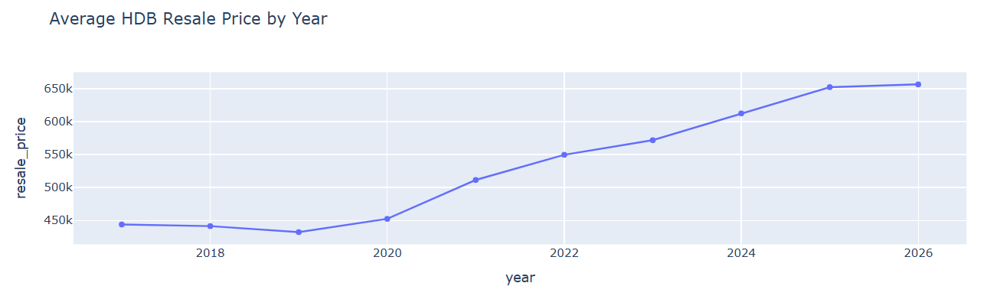

# Singapore HDB Resale Price Analysis and Prediction (2017–2025)

This project analyzes **Singapore HDB resale transaction data from 2017 to 2025** and builds predictive models to estimate resale prices using both statistical and machine learning approaches.

## Project objective

The objectives of this project are to:

- explore HDB resale price trends over time
- identify factors associated with higher resale prices
- test whether mature estates have significantly different resale prices from non-mature estates
- compare baseline linear regression with richer feature-based regression and Random Forest

The goal is to demonstrate practical data science skills such as:

- data cleaning
- feature engineering
- statistical testing
- regression modeling
- machine learning

## Dataset

The dataset contains HDB resale transaction records from **2017 to 2025**.

Main variables include:

- `transaction month`
- `town`
- `flat_type`
- `flat_model`
- `floor_area_sqm`
- `lease_commence_date`
- `resale_price`

## Project workflow

## Data loading and cleaning

- Removed missing values and duplicated rows
- Converted date columns

## Feature engineering

Created new variables:
- **year**: extracted from transaction month
- **remaining_years**: estimated lease remaining using transaction year
- **is_mature**: binary flag for whether the town is a mature estate

## Exploratory Data Analysis

The analysis explores relationships between housing prices and factors such as:
- flat size
- lease age
- location
- mature vs non-mature estates

Key visualizations include:
- price trends over time
- price vs floor area
- price distribution

## Example Visualization

## Hypothesis Testing

A two-sample t-test was performed to test whether resale prices differ between mature and non-mature estates.
- Result: Prices in mature estates are significantly higher on average.

## Predictive Models

Three models were built and compared.

## 1. Baseline Linear Regression

- Features:
  floor_area_sqm,
  remaining_years,
  is_mature
- Purpose: establish a baseline prediction model.

## 2. Expanded Linear Regression

- Additional categorical variables were included.
- Purpose: capture housing characteristics and location effects.

## 3. Random Forest Regressor

- A machine learning model capable of capturing nonlinear relationships.
- Random Forest achieved the best prediction accuracy.

## Technologies Used
- Python
- pandas
- NumPy
- Plotly
- scikit-learn
- statsmodels
- SciPy

## Key Insights

- Larger flats tend to have higher resale prices.
- Mature estates command higher prices.
- Remaining lease length significantly affects resale value.
- Random Forest provides better predictive performance than simple linear regression.

